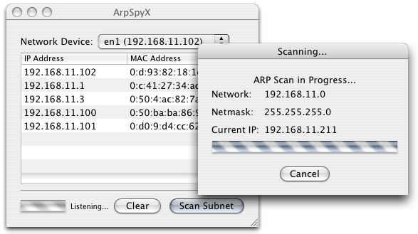

# ArpSpyX - Monitor Arp packets.


Arp packets are an indicator of what machines are active on your network.  ArpSpyX will passively sniff your network for ARP packets and display the IP and MAC address of the machine that generated the packet.

Possible uses of ArpSpyX include:

* Easily gather MAC Addresses of network machines remotely
* Quickly identify new clients on your wireless network
* Identify ARP Poisoning attacks by tracking multiple MAC Addresses for a single IP Address
* Create a text file containing all IP addresses on your network

ArpSpyX supports two methods of scanning.  The first method is a passive mode which will only listen for traffic without sending any packets.  The second method is Active and will send out arp who-has requests for every IP address on your subnet.  The passive method can be used for stealth analysis or for looking for ARP poisioning attacks while the active method is better for system administrators looking to gather details about their networks.

A screenshot of ArpSpyX performing an active scan on my home network is shown below.



To find out more about the Address Resolution Protocol (ARP), you can check out [RFC 826](http://www.faqs.org/rfcs/rfc826.html)


## Requirements

ArpSpyX uses pcap and requires privileged access in order to sniff packets on the network. Therefore, you must allow non-privileged users the ability to read the bpf devices by issuing the following commands.  NOTE: This allows other non-root users to sniff packets from your machine, so make sure you really want to do this.

```
$ sudo chmod go+r /dev/bpf*
```

Future versions may gain privileged access at runtime and will not require this manual command.

## TODO

The following items were considered for release, but are not currently being persued.

* Prompt user for access right elevation in order to open /dev/bpf* without special chmod commands. (Is it better (more secure) to let the user just do the chmod commands?)
* Highlight the row when a duplicate MAC Address is received that doesn't match the existing IP Address.
* Highlight the row when a duplicate IP Address is received that doesn't match the existing MAC Address.
* Add "Beep when new client appears" type feature for notification of new entries
